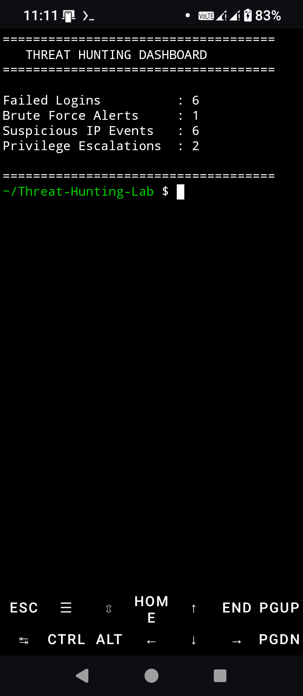
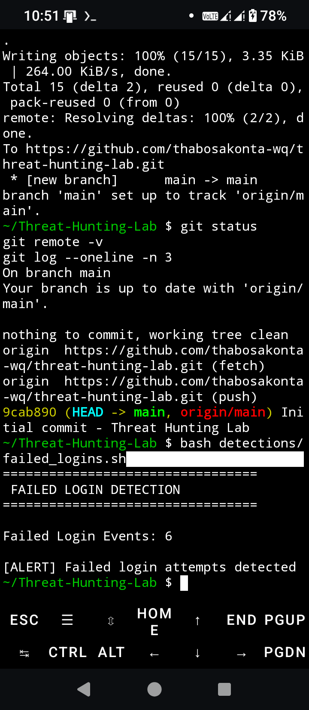
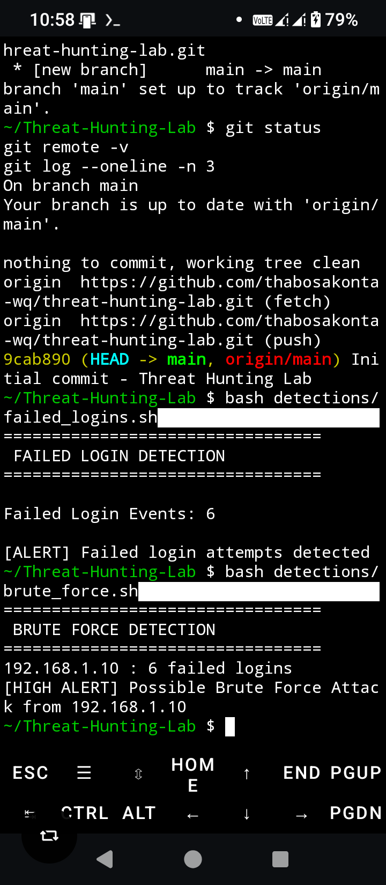
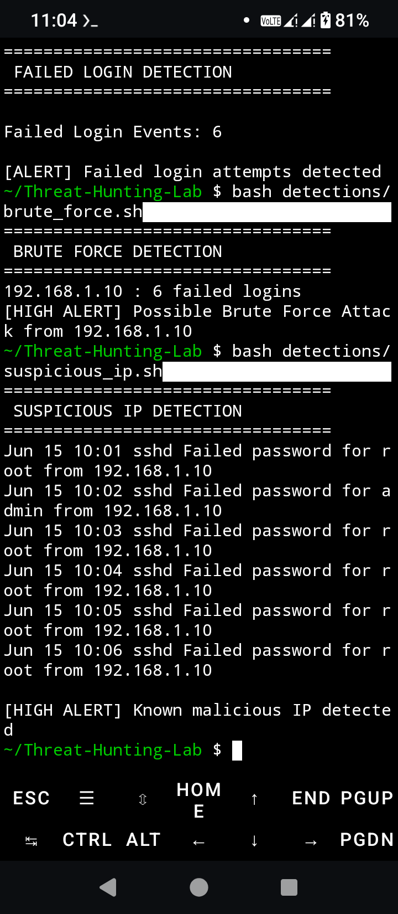
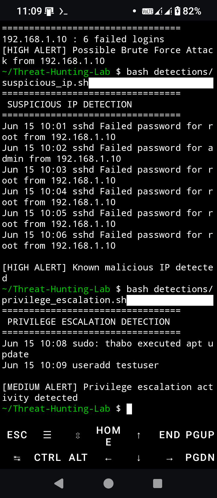
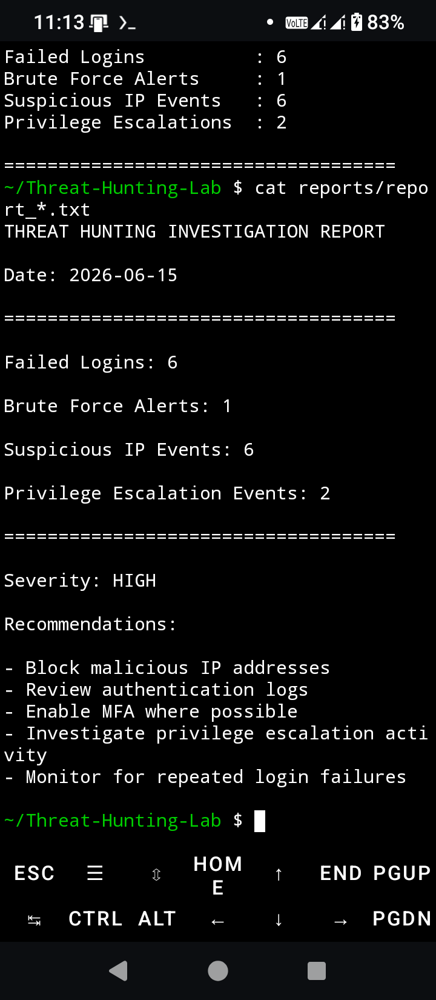

Threat Hunting Lab

A Bash-based Threat Hunting and Log Analysis project demonstrating proactive threat hunting, detection engineering, incident investigation, and MITRE ATT&CK mapping using Linux and Termux.

---

Overview

This project simulates how Security Operations Center (SOC) analysts proactively hunt for threats by analyzing authentication logs, identifying suspicious behavior, and producing investigation reports.

The lab demonstrates detection and investigation of:

- Failed Login Activity
- Brute Force Attacks
- Suspicious IP Addresses
- Privilege Escalation
- Persistence Indicators

---

## Objectives

- Demonstrate proactive Threat Hunting.
- Analyze authentication logs.
- Detect brute-force attacks.
- Investigate privilege escalation.
- Detect persistence mechanisms.
- Map detections to MITRE ATT&CK.
- Produce SOC investigation reports.

## Detection Coverage

| Detection | Severity |
|-----------|----------|
| Failed Login Detection | High |
| Brute Force Detection | High |
| Suspicious IP Detection | Medium |
| Privilege Escalation Detection | High |
| Persistence Detection | High |

## Future Enhancements

- Sigma Rule Integration
- Microsoft Sentinel Integration
- Splunk SIEM Integration
- Elastic SIEM Integration
- Microsoft Defender XDR Integration
- IOC Automation
- Threat Intelligence Feed Integration
- Automated Hunt Scheduling

## Reports

- `reports/executive_summary.md`
- `reports/threat_hunting_report.txt`
- `reports/mitre_mapping.md`

---

## MITRE ATT&CK Coverage

| Technique | ATT&CK ID | Description |
|-----------|-----------|-------------|
| Brute Force | T1110 | Credential Access |
| Valid Accounts | T1078 | Privilege Escalation |
| Create Account | T1136 | Persistence |

---

Threat Hunting Workflow

Authentication Logs

↓

Failed Login Detection

↓

Brute Force Detection

↓

Privilege Escalation Detection

↓

Persistence Detection

↓

Investigation Report

↓

MITRE ATT&CK Mapping

---

## Screenshots

### Threat Hunting Dashboard



### Failed Login Detection



### Brute Force Detection



### Suspicious IP Detection



### Privilege Escalation Detection



### Investigation Report


---

## Technologies Used

- Bash
- Linux
- Termux
- Git
- GitHub
- Threat Hunting
- Detection Engineering
- MITRE ATT&CK
- SOC Operations

---

## Project Structure

```text
Threat-Hunting-Lab
├── detections
│   ├── brute_force.sh
│   ├── failed_logins.sh
│   ├── privilege_escalation.sh
│   └── suspicious_ip.sh
├── hunts
│   ├── brute_force_hunt.sh
│   ├── persistence_hunt.sh
│   └── privilege_escalation_hunt.sh
├── logs
│   ├── auth.log
│   └── threat_hunt.log
├── reports
│   ├── mitre_mapping.md
│   ├── report_2026-06-15.txt
│   └── threat_hunting_report.txt
├── rules
│   └── malicious_ips.txt
├── sample_reports
│   └── investigation_example.txt
├── screenshots
│   ├── dashboard.png
│   ├── failed_login_detection.png
│   ├── brute_force_detection.png
│   ├── suspicious_ip_detection.png
│   ├── privilege_escalation_detection.png
│   └── investigation_report.png
├── dashboard.sh
├── hunt.sh
└── README.md
```

---

## Learning Outcomes

- Threat Hunting
- Detection Engineering
- Incident Investigation
- Security Monitoring
- Bash Scripting
- Linux Administration
- MITRE ATT&CK Mapping
- SOC Operations

---

## Author

Thabo Sakonta

Microsoft Certified Security Operations Analyst (SC-200)

GitHub:
https://github.com/thabosakonta-wq

LinkedIn:
https://www.linkedin.com/in/thabo-sakonta-377a3748

---

## License

This project is intended for educational, research, and cybersecurity portfolio purposes.
